# DDAMI - web (mobile)

## Development
- React.js
- Redux-saga
- styled-components

### install

```
git clone
yarn install
npm run start
```

### Page routing path

- `/` : 메인
- `/join` : 회원가입
- `/login` : 로그인
- `/search` : 검색
- `/workplace` 작업실 관련
    - `/my` : 내 작업실
    - `/:id` : 아이디가 id인 사용자의 작업실
    - `/work/:workId` : workId의 작업물 상세 페이지
    - `/write` : 작업실 글 작성하기
- 햄버거 관련 페이지
    - `/like` : 좋아요한 작품
    - `/purchase` : 판구매 내역
    - `/subscribe` : 찜한 목록
    - `/setting` : 설정
- `/shop` : 따미샵
    - `/pieces`  : 작품샵
    - `/materials` : 재료샵

## Screenshots

모바일 뷰포트(390 x 844) 기준 실제 화면입니다.
API 서버를 붙이지 않은 로컬 개발 서버에서 캡쳐했기 때문에, 목록 데이터와 이미지는
`scripts/screenshot.js`가 넣어주는 목(mock) 응답입니다.

| 메인 `/` | 따미샵 `/shop/pieces` | 작업실 `/workplace/my` |
| :---: | :---: | :---: |
| 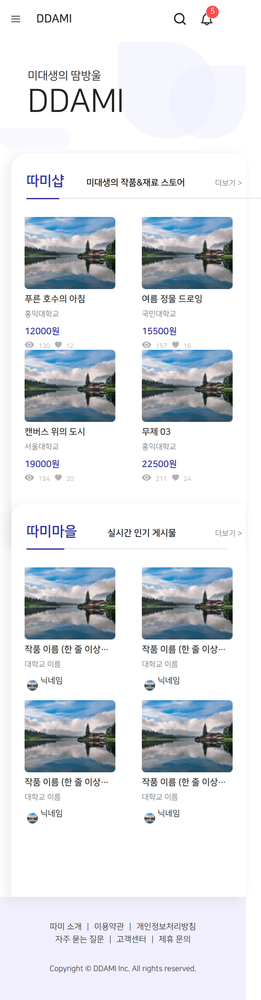 | 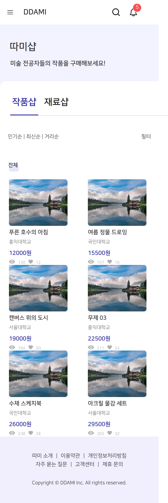 | 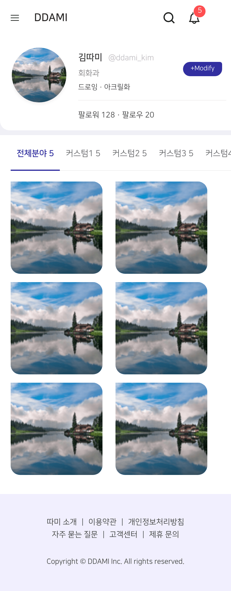 |

| 글 작성 `/workplace/write` | 로그인 `/login` | 회원가입 `/join` |
| :---: | :---: | :---: |
| 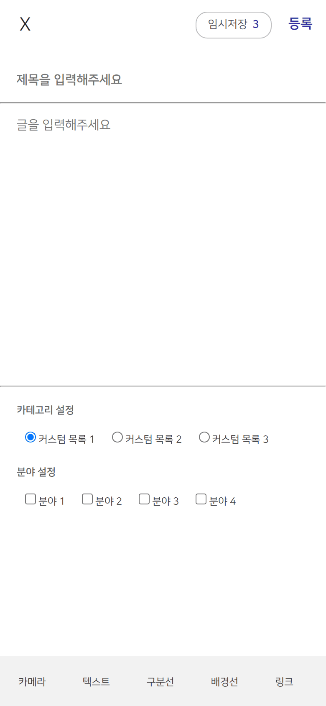 | 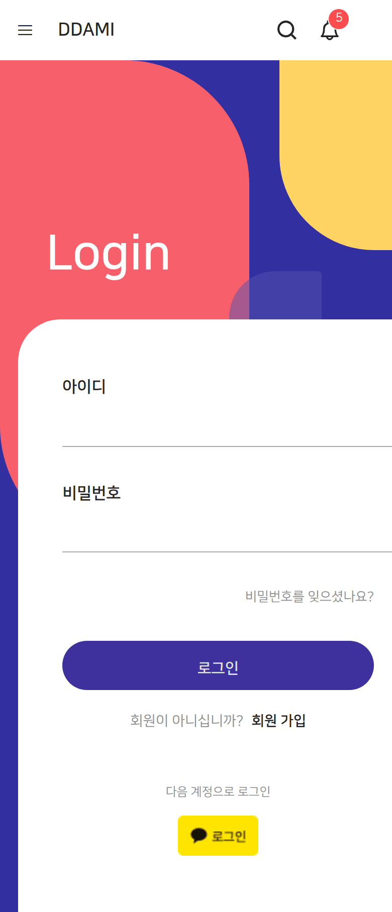 | 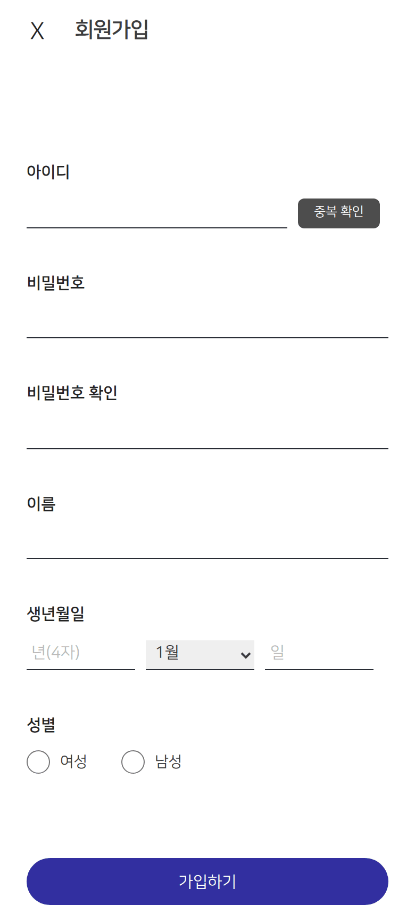 |

| 검색 `/search` | 좋아요한 작품 `/like` | 판구매 조회 `/purchase` |
| :---: | :---: | :---: |
| 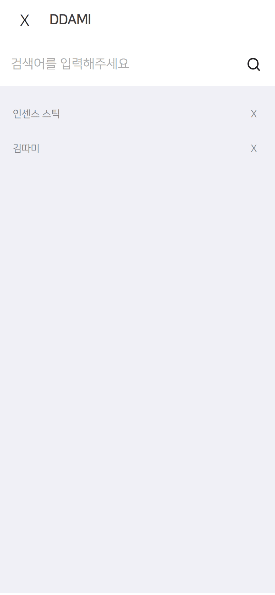 | 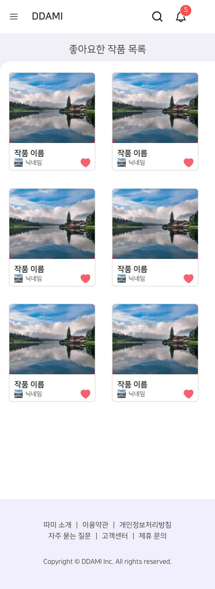 | 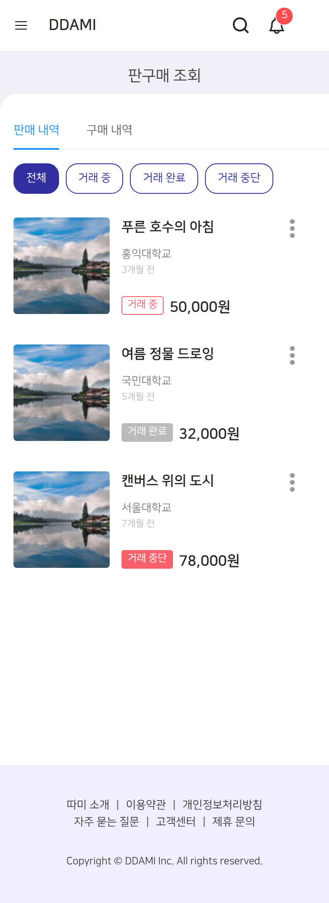 |

| 찜한 목록 `/subscribe` | 설정 `/setting` | |
| :---: | :---: | :---: |
| 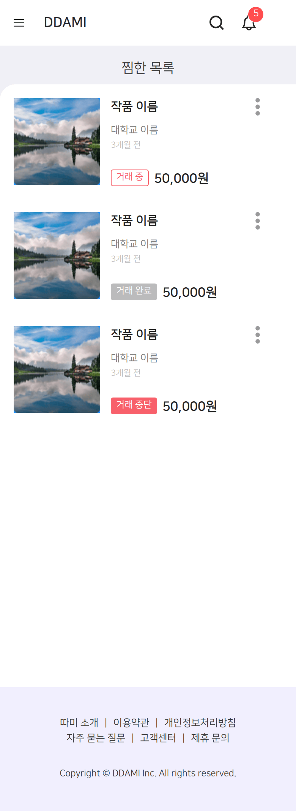 | 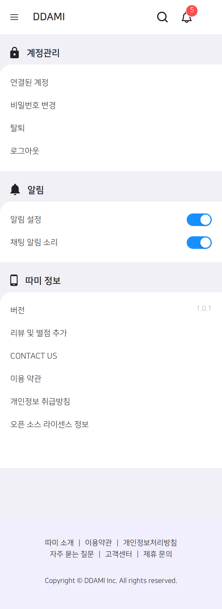 | |

### 캡쳐 다시 만들기

```
npm run start                  # 개발 서버 (http://localhost:3000)
npx playwright install chromium
node scripts/screenshot.js     # docs/screenshots/*.png 갱신
```

## Team

### Developer
- 💻 안샛별 [@sbyeol3](https://github.com/sbyeol3)
- 💻 황보경 [@KimGyeong](https://github.com/KimGyeong)
- 💻 장현호 [@hyunolike](https://github.com/hyunolike)
- 💻 김민정 [@kmin-jeong](https://github.com/kmin-jeong)

### Commit Message Convention

```
Feat : 새로운 기능 추가
Fix : 버그 수정
Docs : 문서 수정
Style : 코드 포맷팅, 세미콜론 누락, 코드 변경이 없는 경우
Refactor : 코드 리펙토링
Chore : 기타 작업
Branch 이름은 기능별로 생성
```
